# A Survey of Recent Advances in CNN-based Single Image Crowd Counting and Density Estimation

### Outline: 

1. Methods rely largely on hand-crafted representations.
2. Deep learning-based approaches.
3. Recently published datasets.
4. Merits of drawbacks of existing CNN-based approaches.
5. Promising avenues.

**Dilemma**: High clutter, overlapping, variation in appearance, scale , perspective and distribution of people and other properties such as illumination.

### Traditional Methods:

1. #### Detection-based:

   1. monolithic style detection.

      + Typically traditional methods which trains a classifier like SVM, Boosting, RF, using hand-crafted features, such as Haar, HOG, etc.

      + Pros & Cons: successful in low density crowd scenes, while adversely affected by the presence of high density crowds.

   2. parts-based detection.

      + Adopting part-based detection methods -- boosted classifier for specific body parts, shape learning.

2. #### Regression-based:

   1. Learn a mapping between features extracted from local image patches to their counts -- low-level feature(edge, texture, gradient, etc) extraction and regression modelling.

   2. Pros & Cons: avoid dependency on detectors, inherently capable of handling imbalanced data.

   3. An example method by Idrees _et al._:

      Fourier analysis + SIFT interest points + head detection -- into --> Markov Random Field -- output --> a cumulative attribute space.

3. #### Density estimation-based:

   1. Improvement: While earlier methods are good at dealing with occlusion and clutter, they were regressing on the global count, ignoring import spatial information. 
   2. Progress 1(linear) by Lempitsky _et al._:
      + Method: **object_density_maps = a_linear_mapping(local_path_features)**, where the integral value of a certain area is the count of objects in it. After that, the problem of learning density maps is formulated as a new regularized risk quadratic cost function, which they solved using cutting-lane optimization.
   3. Progress 2(non-linear) by Pham _et al._:
      + Method: Use **random forest regression** from multiple image patches to vote for density map of objects. To tackle the problem of large variation between crowded patched and non-crowded ones, a crowdedness prior is proposed and two different forests corresponding to this prior are trained.
   4. Progress 3(better performance in computational complexity) by Wang and Zou.
      + Method: Propose a subspace learning-based density estimation to compute the embedding of each  subspace formed by image patches, then learn the mapping between the density map of input and corresponding embedding matrix. In the computation, they speed it up by dividing the feature spaces of image patches and their counterpart density maps into subspaces.
      + Assumption: local image patches and their corresponding density maps share similar local geometry.
   5. Progress 4 by Xu and Qiu:
      + Method: Inspired by the high-dimensional features in other domains, they use a much extensive and richer set of features, and under the limit of that era when regression is under curse of dimensionality, they embedded random projection in the tree nodes to construct random forest, which also introduce randomness in the tree construction.

### CNN-based Methods:

1. #### Category:

   + ##### In terms of Network Property:

     1. ###### Basic CNNs:

        ​	Initial deep learning approaches for crowd counting and density estimation.

     2. ###### Scale-aware models:

        ​	Achieve better robustness to variations in scale by techniques such as multi-column or multi-resolution architectures.

     3. ###### Context-aware models:

        ​	Incorporate local and global contextual information.

     4. ###### Multi-task frameworks:

        ​	Combine crowd counting and estimation along with other tasks such as foreground-background subtraction and crowd velocity estimation.

   + ##### In terms of Training process:

     1. ###### Patch-based inference:

        ​	Use patches cropped from the input images whose size differ among methods. During the prediction phase, a sliding window is used here and predictions from all windows finally aggregated to sum up.

     2. ###### Whole image-based inference:

        ​	As its name, these method avoid computationally expensive sliding windows.

2. #### Methods:

   1. ##### An basic end-to-end deep CNN regression model, by Wang _et al._ and Fu _et al._:

      + Network:
        1. Adopt AlexNet, replace the final 4096 FC later with a single neuron layer for predicting the count.
        2. Fu _et al._ proposed to classify the image into one of the five classes: very high, high ... instead of density maps.
      + Data augment:
        1. Training data is augmented with additional negative samples whose ground truth count is set as zero to reduce false responses background.

   2. ##### Multi-stage ConvNet, by Sermanet _et al_:

      + Improvements:

        ​	Better shift, scale and distortion invariance.

      + Network:

        ​	Use a cascade of two classifiers to achieve boosting where the former one specially samples misclassified image and the latter one reclassifies rejected samples.

   3. ##### Cross-scene counting(apply a mapping learned into new target scenes), by Zhang _et al._:

      + Network:

        ​	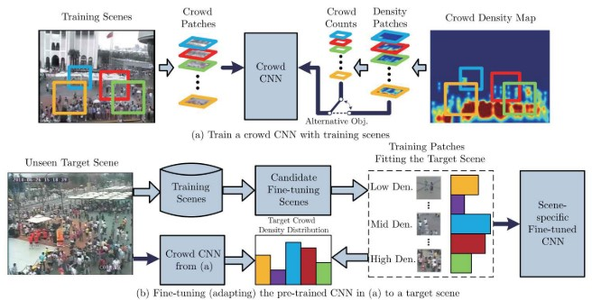

        1. Training: Learn the network by alternatively training on two objective functions: crowd count and density estimation -- X: Crowd patches, Y: Crowd counts / Density patches.
        2. Fine-tuning to a new scene: Use training samples that are similar to the target scene.

      + Improvements:

        ​	Substitute Gaussian kernels which are used for generating ground truth density map with a new method that can incorporate perspective information in the generated map.

      - Cons:
        1. Heavily dependent on accurate perspective maps which may not unavailable for all the datasets.
        2. The use of 72x72 sized patches ignores global context.

   4. ##### Layered boosting and selective sampling, by Walach and Wolf:

      + Network:

        ​	Inspired by Cross-scene counting and Gradient Boosting Machines(GBM).

        ​	Layered boosting: iteratively adding CNN layers to model -- (n+1)-th CNN layer is trained on the difference between the estimation of n-th CNN layer and ground truth.

      ​	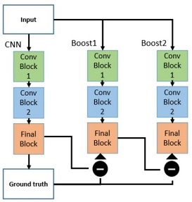

      + Selective sampling:

        ​	samples that are correctly classified early on are trivial samples, which tend to introduce bias in the network for such samples and therefore affecting its generalization performance.

      + Cons:

        1. Involve patch-based training and evaluation  which cause the loss of global context information.
        2. Tend to ignore scale variance.

   5. ##### End-to-end count estimation taking the entire image, by Shang _et al._:

      + Network:

        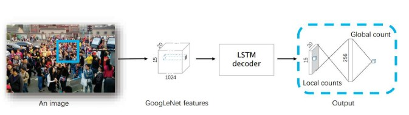

   6. ##### Combine deep and shallow fully convolutional networks, by Boominathan _et al._:

      + Network:

        ​	The combination of both deep and shallow FCN makes the network more robust to  non-uniform scaling of crowd and variations in perspective.

        ​	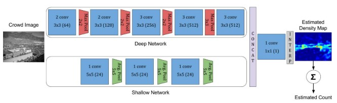

      + Data augmentation:

        ​	Sample patches from the multi-scale image representation to make model more robust to scale variations.

   7. ##### Multi-column CNN for images with arbitrary crowd density and arbitrary perspective, by Zhang _et al._:

      + Network:

        ​	Comprises of three columns corresponding to filters with receptive fields of different sizes(corresponding to the various sizes of sliding windows).

        ​	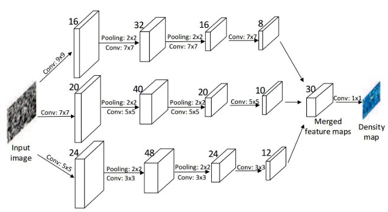

      + Improvement:

        ​	Take into account perspective distortion by estimating spread parameter of the Gaussian kernel based on the size of the head of each person within the image, and the spread parameter for each person is data-adaptively determined based on its average distance to its neighbors.

      + Dataset:

        ​	Contribute the ShanghaiTech crowd datasets.

      + Cons:

        1. The extent of invariance achieved is limited by the number of columns and receptive field sizes.
        2. Can not explicitly model global context information.

   8. ##### Hydra CNN, by Onoro and Sastre:

      + Network:

        ​	Inspired by earlier work which shows that incorporating perspective information for geometric correction of the input features results in better accuracy.

        ​	Counting CNN is a FCN network with six convolutional layers. and Hydra-CNN has several heads and each of them put image patches into a CCNN and the outputs are concatenated and then be put into three FC layers to produce a density map. What is important to mention is that  different heads  extract image descriptors at different scales(by image pyramid, corresponding to the image pyramid used in traditional sliding windows detection), and that made Hydra CNN able to perform successfully in datasets with significant variations.

        ​	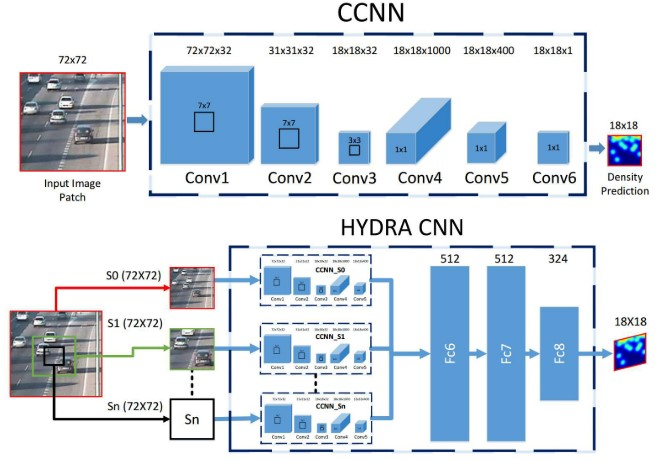

      + Cons:

        ​	Similar to those of the Multi-column CNN.

   9. ##### Switching CNN, by Sam _et al._:

      + Assumption:

        ​	Better better regressors are those which leverage variation of crowd density within an image instead of training all regressors of a multi-column network on all patches.

      + Network:

        ​	Many independent CNN crowd density regressors which are trained on patches sampled from a grid in a given crowd scene + a switch classifier used to select the optimal regressor for different input patches.

        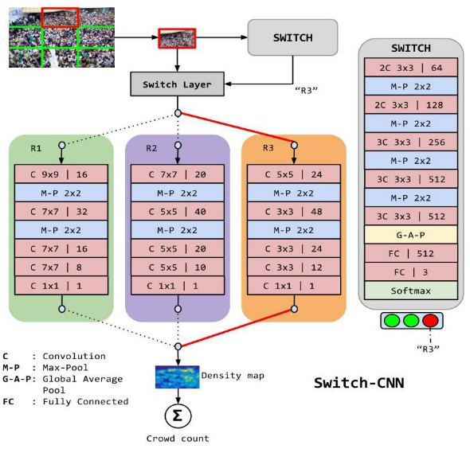

      + Cons:

        ​	Similar to those of the Multi-column CNN.

   10. ##### Integrate semantic information , by Sheng _et al._:

       + Improvement:

         ​	Propose a new image representation which integrates semantic information by learning **locality-aware feature** sets, which are inspired by spatial pyramids on neighboring patches thereby encoding context, since hand-crafted features ignored key semantic and spatial information.

         ​	The neighboring descriptors are encoded into image representations using weighted VLAD encoding method.

   11. ##### MoCNN, by Kunagai _et al._:

       + Similar to the Switching CNN above, MoCNN consists of many Expert CNNs(estimate number) and a Gating CNN(give different Expert CNN different weights to do the weighted sum of them).

       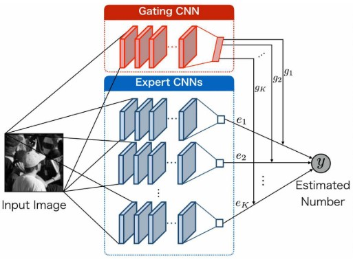

       + Cons:

         ​	Similar to those of the Multi-column CNN.

   12. ##### A single column fully convolutional network, by Marsden _et al._:

       + Method:

         ​	Feed multiple scales of test image into the network during prediction phase, and take an average of all the estimates at last.

       + Data augmentation:

         ​	Use the four image quadrants of original and horizontally flipped images, in avoid of the overfit that may be caused by the exposure to the same set of pixels during training.

       + Cons:

         1. Result in an inefficient inference stage.
         2. Cannot explicitly encode global context, whereas few approaches are trying to model local and global context by key spatial and semantic information.

   13. ##### A multi-task network do the crowd counting, behaviour detection and crowd density level classification simultaneously, by Marsden _et al._:

       + Network:

         ​	Consists of initial 5 convolutional layers of ResNet18 + a set of task specific layers, output of sum of all the losses of different tasks.

   14. ##### Incorporate crowd count level as a prior into the density estimation network, by Sindagi _et al._:

       + Network:

         ​	Classify crowd count into various levels which is later incorporated into the density estimation network as a high-level prior. This enables the layers in the network to learn globally relevant discriminative features.

         ​	Besides, transposed convolutional layers are used to generate high resolution density maps.

         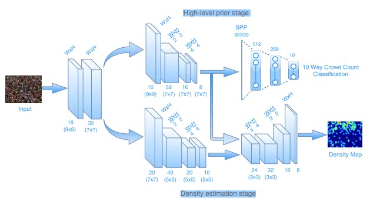

       + Cons:

         1. The number of density levels which is used as high-level prior can differ among different datasets.

   15. ##### Using full-resolution density maps, by Kang _et al._:

       + Methods for generating full-resolution maps:
         1. A sliding window based CNN regressor is used for pixel-wise density prediction.
         2. Fully convolution networks along with skip connections are used to learn a non-linear mapping between image and density map.

### Datasets:

1. #### UCSD dataset:

   + Collected from pedestrian walkway.
   + 2000 frames of size 238x158.
   + Crowd density: Relatively low, around 15 people in a frame on average.
   + Variation in perspective: No.

2. #### Mall dataset:

   - Collected from a surveillance camera installed in a shopping mall.
   - 2000 frames of size 320x240.
   - Crowd density: Various levels with different activity patterns(static and moving crowds).
   - Variation in perspective: No, but there is severe perspective distortion in scene which caused large variation in the size and appearance of objects.

3. #### UCF_CC_50 dataset:

   + Collected from web.
   + 50 images of varying resolutions.
   + Crowd density: Go through a wide range from 94/image to 4543/image.
   + Variation in perspective: Definitely.

4. #### WorldExpo'10 dataset:

   + Collected from 108 surveillance cameras from Shanghai 2010 WorldExpo event.
   + 3980 frames of size 576x720 with 199923 labelled pedestrians.
   + Crowd density: Maximum is 220, not enough dense.
   + Variation in perspective: Yes.

5. #### Shanghai Tech dataset:

   + Collected from streets of metropolitan areas in Shanghai.
   + 1198 images with 330165 annotated heads.
   + Crowd density: Higher in part A , lower in part B.

6. #### To summarize:

   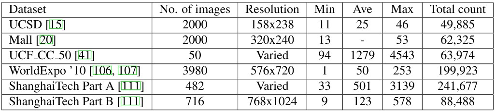

### Results:

1. ##### Evaluation standard:

   ​	MAE and MSE.

2. ##### Some statistic comparison conclusion:

   1. In general, CNN-based methods  outperform the traditional approaches across all datasets.
   2. CNN-based methods are better especially in the scenes with large density crowds.
   3. Among the CNN-based methods, most improvements are triggered by scale-aware and context-aware models, that's also sort of the reason why the more complex models can achieve lower count error.
   4. Layered boosting can achieve performances comparable to scale aware models.
   5. The selective sampling used in layered boosting helps to obtain unbiased performance.
   6. Whole image-based methods are less computationally complex and can achieve better results over patch-based techniques.
   7. Layered boosting and selective sampling reduce the training time significantly.

3. #### Result table:

   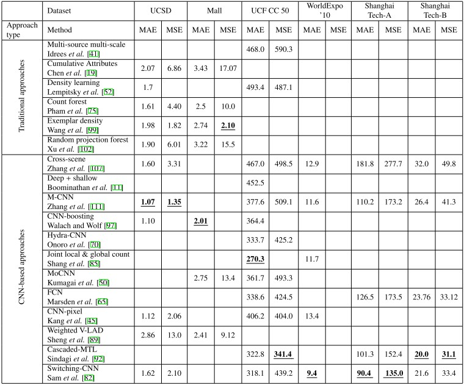

### Problems existing:

1. Datasets are still not big enough.
2. Transfer learning in crowd counting models is not mature.
3. Achieve accuracy and low-latency simultaneously.
4. Losses used nowadays such as Euclidean loss have certain disadvantages, and result in low quality density maps.
5. Incorporating more additional contextual and scale information.

