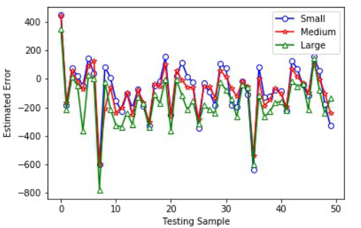
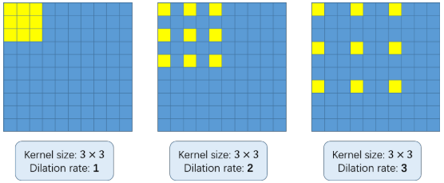

# CSRNet: Dilated Convolutional Neural Networks for Understanding the Highly Congested Scenes

> Yuhong Li, Xiaofan Zhang, Deming Chen

### Overview:

- **Structure**: A front-end CNN used for feature extraction, and _dilated convolution_ used to deliver larger reception fields and to replace polling operations.
- Improvement:
  1. Large receptive fields.
  2. Without losing resolutions.
  3. Easy to extend to similar work, such as vehicle counting.

### Some basic concepts:

0. PSNR and SSIM are both a way to evaluate the quality of image restoration.

1. **PSNR** -- "Peak Signal-to-Noise Ratio":

   + Formula: ^2}{MSE}})
   + May not be corresponding to the feeling of human eyes.

2. **SSIM** -- "Structural Similarity in Image".

   + Formula: =\frac{(2\mu_x\mu_y+C_1)(2\sigma_x\sigma_y+C_2)}{(\mu_x^2+\mu_y^2+C_1)(\sigma_x^2+\sigma_y^2+C_2)}),

     where , ^2}}^{\frac{1}{2}}), (y_i-\mu_y))

   + When used in a local area, the effect is better than that when used in global area.

### Key points:

+ Multi-column architecture doesn't work as it was expected -- as the experiment shows, different branches seem to learn nearly identical features:

​	Besides, this kind of architecture is hard to train.

+ Dilated convolution -- convolution with sparse kernels, a good alternative of pooling layer. In my personal view, it's just very similar to the function of image pyramid(upsampling the image versus downsampling the kernel).

+ Data argumentation here:

  ​	9 * 2 = 18: do the mirror operation on 4 quarters and 5 patches randomly cropped from the input image.

### Conclusion:

+ **Remain**:
  1. Geometry-adaptive kernels, though fixed kernels with different sigma are used on several datasets.
+ **Improvement**:
  1. One channel, no branch.
  2. Dilated convolution.
  3. Data augmentation.
  4. Extending the work into other similar tasks such as vehicle counting.

### Inspiration:

1.  The kernel used for generating density maps are not fixed, so the _geometry-adaptive kernel_ proposed in MCNN maybe not the final solution.
2. The progress of relative fields do have contribution to crowd counting, such as the dilated convolution in CSRNet, which is actually a quite simple structure.