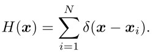
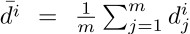
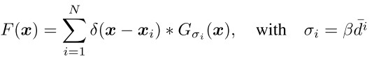
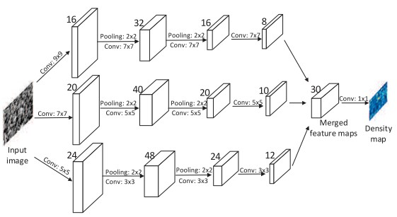

# Single-Image Crowd Counting via Multi-Column Convolutional Neural Network

> Yingying Zhang Desen Zhou Siqin Chen Shenghua Gao Yi Ma Shanghaitech University

### Overview:

+ Different columns have filters with different sizes which are useful for learning the features with different perspective property and image resolution.
+ A new dataset,
+ Model well-trained can be readily transferred between datasets.
+ Replace the FC layer at the end with a 1x1 convolution layer, which can enable the model to have arbitrary input size to avoid distortion.

### Key points:

- Density map via geometry-adaptive kernels:

  - An image with N heads labelled can be represented as: 

  To convert this into a continuous density function, we may use a Gaussian kernel G_sigma so that the density is `F(x) = H(x) * G_sigma(x)`. However, this density function assumes that these x_i are independent samples, which is not the case here where there are not even distribution of samples and perspective distortion.

  - The former assumption is hard to realize, but we can make an smaller assumption that the crowd around each head in a small near area is distributed evenly. Then we can give a reasonable estimate of the geometric distortion based on the average distance between the head and its nearest k neighbours.

  - So, to a head x_i in the image, we get its k nearest neighbours as {d_1^i, ..., d_m^i}, of which the average is , and the variance \sigma_i is proportional  to it:

    

    F -- density map, \beta -- the proportion factor.

- Multi-column CNN structure:

  

- Some operations in the MCNN worth mentioning:

  1. Since all the input flows walk through two 2x2 pooling, the density map output is 1/4 size of the original input. So we down-sample each training sample by 1/4 before generating it density map.
  2. The shape of inputs here is arbitrary -- original size of input images, since the resize operation may introduce additional distortion.
  3. Just before the output, we use 1x1 convolution to combine the outputs of the three channels.

- Optimization:

  ​	The gradient vanishing is very serious here, and the parameters in the three channels are difficult to be learnt well simultaneously. Motivated by the pre-training method of RBM, we train each single channel first to generate the initial weights, then concatenate them and fine-tune the whole model.

- Tricks in the transfer learning between different dataset:

  ​	If the target domain only contains a few training samples, we may freeze the first several layers in each column.